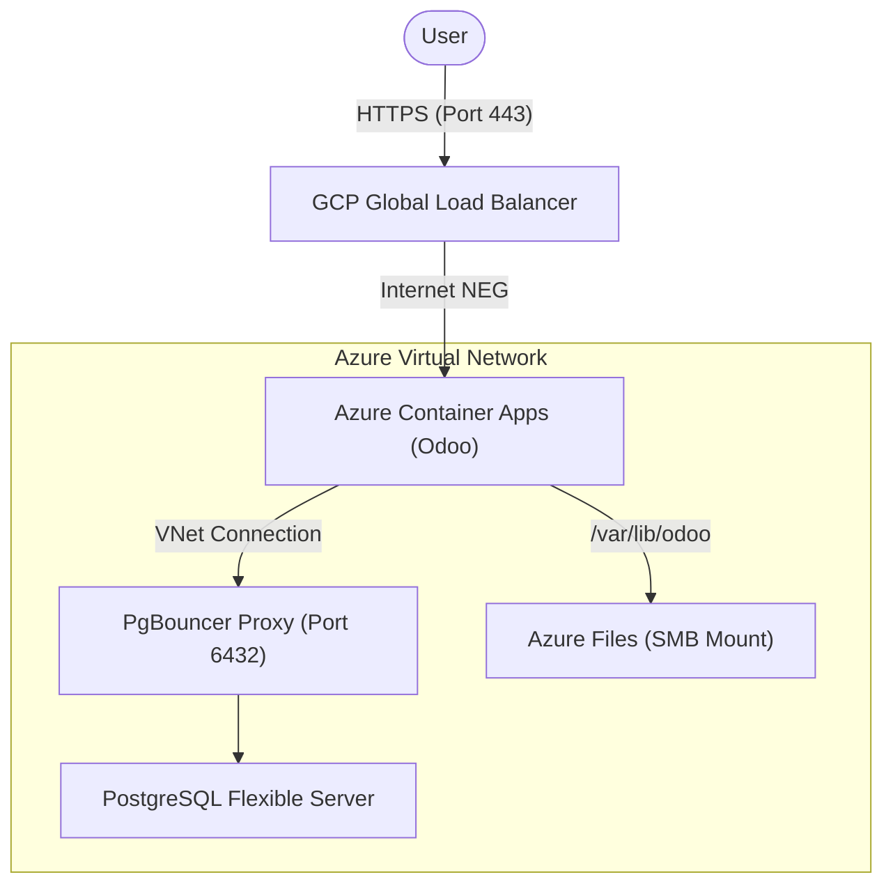

# 🏢 ESMOS Odoo: Enterprise ERP for Azure Container Apps

This repository contains the deployment configuration and lifecycle management for **Odoo**, the primary ERP and business management suite for the ESMOS Healthcare platform.

## 🏗️ Key Design Principles

The ESMOS Odoo deployment is architected for maximum stability and data integrity within a serverless container ecosystem:

*   **Persistence-First Strategy**: Mounts **Azure Files** directly via SMB to ensure that the Odoo filestore (attachments, generated reports, etc.) remains persistent across container restarts and scaling events.
*   **Connection Resilience**: Configured to connect via **PgBouncer** (Port 6432) on the Azure Database for PostgreSQL. This prevents Odoo's worker-based connection model from exhausting the primary database's available sockets.
*   **Scale-to-Zero Optimization**: Leverages Azure Container Apps' consumption tier, allowing the Odoo instance to scale down to zero replicas during inactive periods to optimize resource utilization.
*   **VNet Isolation**: All traffic between the Odoo application and the PostgreSQL backend remains purely internal to the Azure Virtual Network, ensuring healthcare data never traverses the public internet.

---

## 📐 Architecture



### Component Breakdown

| Component | Technology | Responsibility |
| :--- | :--- | :--- |
| **ERP Application** | Odoo (Python/Web) | Core business logic, inventory, and record management. |
| **Web Gateway** | GCP Search / LB | Global entry point and HTTPS termination. |
| **Filestore** | Azure Files | Persistent storage for binary assets and document attachments. |
| **Database** | PostgreSQL | Relational storage for business records and platform state. |

---

## 📂 Project Structure

```text
.
├── terraform/          # Infrastructure-as-Code for Odoo ACA deployment
├── .github/workflows/  # CI/CD pipelines for automated image builds
├── docker-compose.yml  # Local development environment (Full Odoo + PG stack)
├── filestore/          # Local staging for Odoo persistent data
└── README.md           # Engineering documentation
```

---

## 🔐 Configuration

Odoo is configured using a blend of environment variables and the `db-filter` argument to enforce multi-tenant isolation.

### Database Connection
| Variable | Value | Description |
| :--- | :--- | :--- |
| `HOST` | `[Managed DB Host]` | FQDN of the PostgreSQL Flexible Server. |
| `PORT` | `6432` | Must use the PgBouncer port. |
| `USER` | `[Auth-User]` | Database identifier retrieved from Key Vault. |
| `PASSWORD` | `[Auth-Pass]` | Secret retrieved from Key Vault. |

---

## 🚀 Operational Guide

### 1. Local Development
To launch a complete Odoo environment locally:
```bash
docker compose up --build
```
Access the local Odoo web interface at `http://localhost:8069`.

### 2. Cloud Deployment (Azure)
Deploy the infrastructure layer using the provided Terraform module:
```bash
cd terraform
terraform init
terraform apply
```

### 3. Database Management
Odoo's `--db-filter` is hardcoded to `^odoo$` in production to ensure strict data scoping. Any database initialization must be done via the Odoo database manager using the `MASTER_PASSWORD`.

---
*Maintained by the ESMOS Healthcare Development Team.*
